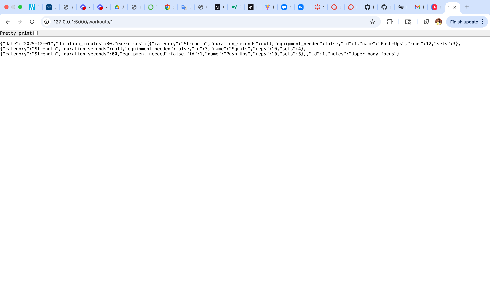

# Flask SQLAlchemy Workout API

A simple REST API built with Flask and Flask-SQLAlchemy for managing workouts and exercises.

This project demonstrates:
- SQLAlchemy relationships
- Join tables
- Flask REST endpoints
- Database migrations
- Seeding a database

## Setup Instructions

1. Clone the repository
```bash
git clone https://github.com/N252614/flask-sqlalchemy-workout-api.git
cd flask-sqlalchemy-workout-api
```
2. Install dependencies
```bash
pipenv install
pipenv shell
```
3. Run migrations
```bash
flask db upgrade
```
4. Seed the database
```bash
python server/seed.py
```
5. Start the server
```bash
python server/app.py
```
The API will be available at:
http://127.0.0.1:5000

### API Endpoints

Get all workouts

GET /workouts

Get a single workout with exercises

GET /workouts/<id>

Add an exercise to a workout

POST /workouts/<workout_id>/exercises/<exercise_id>/workout_exercises

### Example Response

{
  "date": "2025-12-01",
  "duration_minutes": 30,
  "exercises": [
    {
      "name": "Push-Ups",
      "sets": 3,
      "reps": 10
    }
  ]
}
### Screenshot

### Technologies Used
 • Python
 • Flask
 • Flask-SQLAlchemy
 • Flask-Migrate
 • SQLite
 • Pipenv
